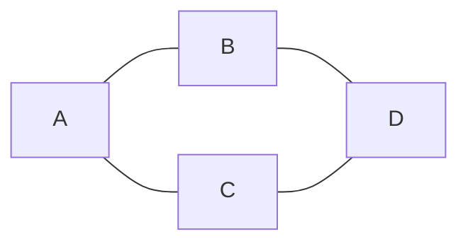
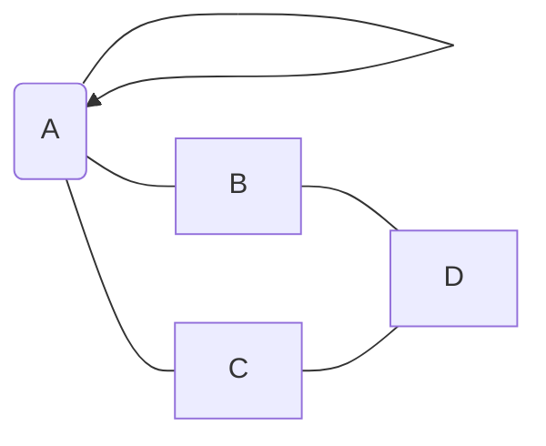
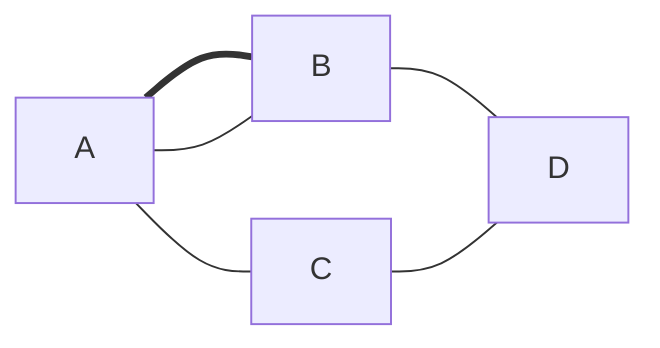

## Enkel graf vs. Ikke-enkel graf

### Hva er forskjellen?

En **enkel graf** (simple graph) har:
- Ingen **løkker** (kanter fra en node til seg selv)
- Ingen **multiple kanter** (flere kanter mellom samme par noder)

En **ikke-enkel graf** (multigraf) kan ha:
- Løkker (edges from a node to itself)
- Multiple kanter (parallelle kanter)

### Eksempel 1: Enkel graf

Dette er en enkel graf med 4 noder og 4 kanter:

ikke enkel graf med løkke

ikke enkel graf med paralelle kanter
