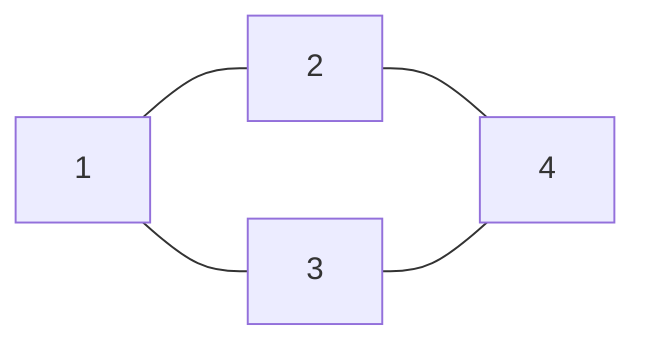

## Hva er en graf?
En **graf** $G = (V, E)$ består av:
- $V$: en mengde **nodepunkter** (vertices/hjørner)
	- En grad er hvor mange kanter som går inn i et punkt
- $E$: en mengde **kanter** (edges) som forbinder nodene
### Eksempel
En graf med $V = \{1, 2, 3, 4\}$ og $E = \{\{1,2\}, \{1,3\}, \{2,4\}, \{3,4\}\}$:

### Begreper

| Begrep | Definisjon |
|--------|------------|
| **Bro** | dette er en kant som hvis den fjerner gjør grafen til flere elementer |
| **Krets** | bindingen mellom to noder |
| **Sti** | En vandring som ikke går igjennom samme node eller kant to ganger |
| **Spor** | En vandring som ikke går igjenom samme kant to  |
| **Vandring** | veien mellom to noder. kan gå igjennom samme node to ganger og kanter |
