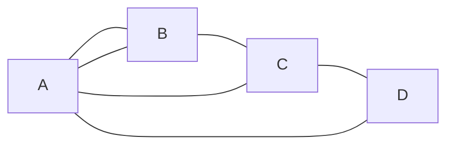

# Antall vandringer mellom to noder

## Hva er en vandring?

En **vandring** (walk) i en graf er en følge av noder der hvert påfølgende par er forbundet med en kant. Kantene og nodene kan **gjentas**.

### Eksempel på vandring

Vandring fra A til D: A → B → C → D 
En annen vandring: A → C → A → B → D 
En lengre vandring: A → B → C → A → B → C → D

Her er det også viktig å legge merke til at vi går på kantene så to stier kan se helt like ut men gå på forskjellige kanter