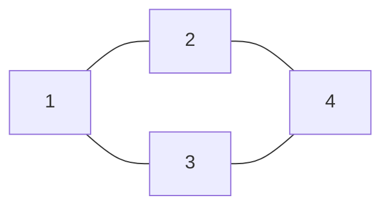

## Hva er en graf?
En **graf** $G = (V, E)$ består av:
- $V$: en mengde **nodepunkter** (vertices/hjørner)
- $E$: en mengde **kanter** (edges) som forbinder nodene
### Eksempel
En graf med $V = \{1, 2, 3, 4\}$ og $E = \{\{1,2\}, \{1,3\}, \{2,4\}, \{3,4\}\}$:


## Nøkkelformler
### Euler’s formel for plane grafer
For en sammenhengende plan graf:
$$V - E + F = 2$$
der $F$ er antall flater (inkludert den ytre flaten)
### Farging av grafer
- **Kromatisk tall** $\chi(G)$: Minste antall farger som trengs for å farge nodene slik at ingen naboer har samme farge
- **Fargeteorem**: $\chi(G) \le 4$ for alle plane grafer (firfargeteoremet)
### Eksempel: $K_4$ har $\chi(K_4) = 4$
```mermaid
graph TD
    1 --- 2
    1 --- 3
    1 --- 4
    2 --- 3
    2 --- 4
    3 --- 4